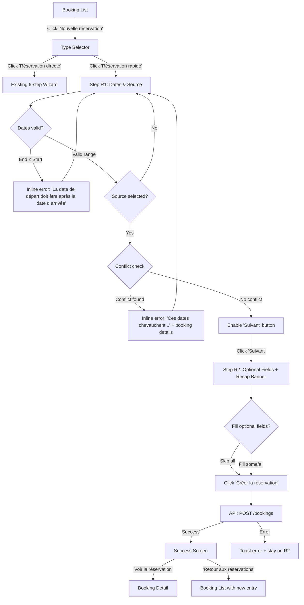
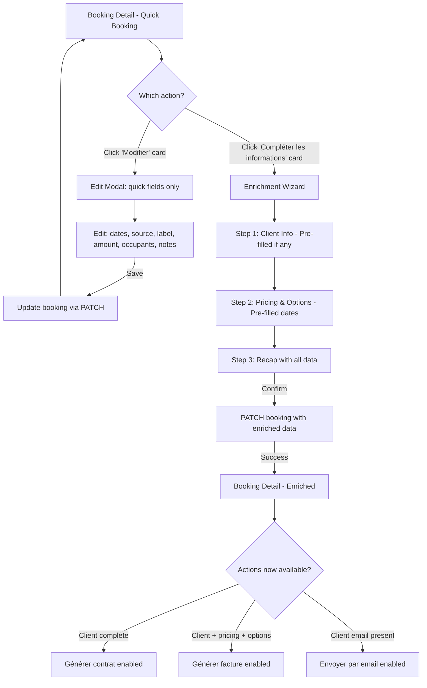
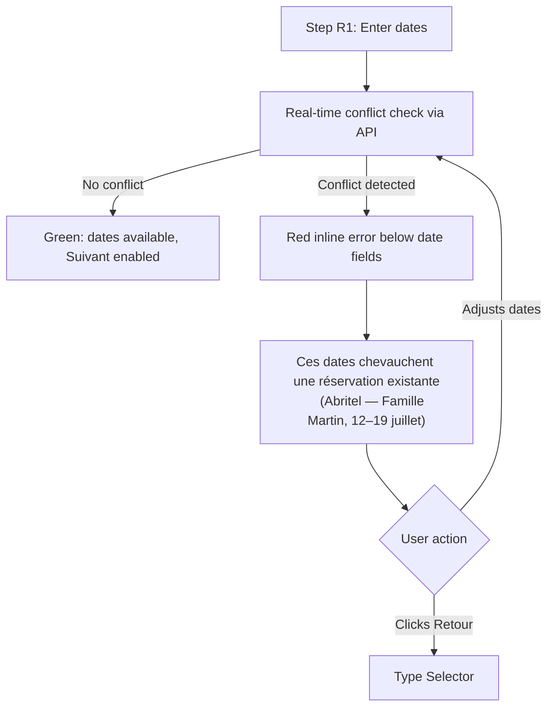

# UX Design Specification maison-dalhias

**Author:** Jordan
**Date:** 2026-02-20

---

## Executive Summary

### Project Vision

Maison Dalhias is a purpose-built vacation rental management app for a single property in Ardèche, France. The existing admin dashboard handles direct bookings through a 6-step wizard with automated contract/invoice PDF generation and one-click email sending. However, ~50% of bookings come from external platforms (primarily Abritel) or are personal/family blocks — these cannot currently be tracked without the full wizard, leading to split tracking and paper fallback.

The UX design extends the existing dashboard with a multi-source booking system: a unified booking model with differentiated creation flows that enables all reservation types to coexist in a single view. The design challenge is to add significant new capability while maintaining the simplicity that makes the app usable by its senior target audience.

### Target Users

**Primary: Christelle (57, Property Manager)**
- Sole manager of the vacation rental: bookings, client communication, contracts, invoices
- Desktop PC for admin tasks; smartphone for everyday digital tools
- Comfortable with basic digital tools (email, social media, e-commerce) but zero technical background
- Core motivation: "Je veux ouvrir l'appli et voir toute ma saison d'un coup d'oeil, sans avoir à vérifier sur un papier à côté."
- Key frustration: the full wizard is too heavy for simply blocking dates from Abritel bookings

**Secondary: Jordan (Developer)**
- Built and maintains the application; occasional configuration and support
- Every friction point in the UI becomes a phone call — the goal is zero support interventions for booking management

### Key Design Challenges

1. **Dual-flow coexistence**: The 6-step direct wizard (unchanged) and the 2-step quick flow must cohabitate naturally. The type selector at step 1 must make the choice obvious, impossible to miss, and impossible to confuse. Senior users need explicit labels, not subtle UI patterns.

2. **Graceful data absence**: The existing BookingDetailView assumes complete data (client info, pricing, options). Quick bookings may have only dates and a source. The detail page must adapt its layout to show what exists and clearly indicate what's missing — without looking broken or empty.

3. **Two edit actions, one mental model**: "Modifier" (lightweight modal for quick fields) and "Compléter les informations" (partial pre-filled wizard for full enrichment) are functionally different but conceptually adjacent. The UI must make the distinction crystal clear through visual design, labeling, and placement.

4. **Badge system without visual overload**: Source badges (blue for platforms, purple for personal/family, existing style for direct) must provide instant visual recognition in the booking list without competing with status badges (PENDING/CONFIRMED/CANCELLED) or other card information.

### Design Opportunities

1. **Quick flow as the "magic moment"**: Creating a booking in 2 fields and <30 seconds is the experience that will convince Christelle to abandon paper tracking permanently. Every design decision in the quick flow should optimize for speed, clarity, and confidence.

2. **Conditional actions as progressive reward**: As data is enriched, action buttons (contract, invoice, email) activate naturally. This creates a satisfying progression: more data → more capabilities, visible and tangible. The disabled state with explicit "missing data" messages guides without frustrating.

3. **Unified season view as trust builder**: Seeing all bookings — direct, Abritel, family — in a single chronological list with colored source badges delivers the North Star vision. This is the screen Christelle will open every morning. It must feel complete, scannable, and confident.

4. **Existing design language as foundation**: The current app has a mature visual system (Airbnb-inspired cards, #FF385C primary color, section-based edit modals, toast feedback). New components should feel native to this system, not bolted on.

## Core User Experience

### Defining Experience

The core experience of maison-dalhias is **unified booking management**: recording every reservation — direct, platform, or personal — in a single system with minimal friction appropriate to each type.

**Core loop:**
1. A booking event occurs (Abritel email, phone call, family decision)
2. Christelle opens the admin dashboard
3. She creates the appropriate booking type (direct wizard OR quick flow)
4. The booking appears in the unified list with instant visual identification
5. Over time, she enriches quick bookings as needed, unlocking document capabilities

**The critical interaction to nail:** The type selector at wizard step 1. This is the branching point where the entire multi-source system succeeds or fails. Two large visual cards — "Réservation directe" and "Réservation rapide" — must make the choice obvious, confident, and reversible. If Christelle hesitates at this screen, the feature fails.

**The secondary critical interaction:** The booking list with mixed sources. If badges are confusing, if the list feels cluttered, or if sources aren't instantly distinguishable, the "complete season view" promise breaks down.

### Platform Strategy

| Aspect | Decision |
|--------|----------|
| **Primary platform** | Desktop PC (Chrome latest) — all new features optimized for desktop first |
| **Input method** | Mouse/keyboard — large click targets (48px+) but no touch optimization needed |
| **Responsive** | Existing mobile layout maintained; new screens follow existing responsive patterns (768px/1200px breakpoints) but are not mobile-optimized |
| **Offline** | Not required — always-online assumption (single property, admin use only) |
| **Performance** | Standard SPA performance — <1s transitions, no specific benchmarks for 2-user system |
| **Browser** | Chrome only — no cross-browser testing or polyfills |

### Effortless Interactions

1. **Quick booking creation**: 2 required fields (dates + source), everything else optional. The system auto-determines BookingType from source selection. No pricing, no client details, no options — just dates blocked.

2. **Source recognition at a glance**: Colored badges in the booking list provide instant visual classification. Blue = platform (Abritel, Airbnb, Booking.com). Purple = personal/family. Existing style = direct. The brain recognizes the color before reading the text.

3. **Conditional action discovery**: Buttons for contract, invoice, and email appear based on data completeness, not booking type. Disabled buttons show explicit French messages ("Informations client requises pour générer le contrat"). No guessing about what's possible or why.

4. **Source-to-type automation**: When Christelle selects "Abritel" from the source dropdown, the system automatically classifies it as EXTERNAL. She never sees or interacts with BookingType directly — it's an implementation detail hidden behind the human-readable source name.

5. **Pre-fill everything**: When enriching a quick booking, all previously entered data is pre-filled. Date entered once, name entered once — never re-entered. The system respects the user's time.

### Critical Success Moments

| Moment | Description | Design Impact |
|--------|-------------|---------------|
| **First quick booking** | Christelle creates an Abritel booking in <60 seconds without help | Quick flow must be discoverable, obvious, and confidence-inspiring |
| **Complete season view** | All bookings visible in one list with source badges | List must feel unified, not cluttered; badges must be scannable |
| **Enrichment reward** | Completing client info activates the "Générer contrat" button | Transition from disabled→enabled must be visually satisfying |
| **Conflict protection** | System catches overlapping dates with clear French error | Error message must name the conflicting booking explicitly |
| **Paper retirement** | Christelle stops maintaining parallel paper tracking | Requires sustained trust — the app must never lose or hide data |

### Experience Principles

1. **"Fewer fields = more value"**: Every absent field in the quick flow is friction removed. The minimum viable booking is dates + source. Everything else is progressive enrichment, never upfront requirement.

2. **"One ecosystem, no second-class citizens"**: Quick bookings participate in the same calendar, same conflict checking, same list, same detail page as direct bookings. They are not "lesser" bookings — they are bookings with less data (so far).

3. **"The interface adapts to the data, not the type"**: Available actions (contract, invoice, email) depend on what data has been filled in, not on whether the booking is DIRECT, EXTERNAL, or PERSONAL. A fully enriched EXTERNAL booking has the same capabilities as a DIRECT booking.

4. **"One button = one action"**: Every interactive element does one clear thing. No multi-function buttons, no hidden menus, no long-press actions. Labels are explicit French verbs: "Confirmer", "Modifier", "Compléter les informations", "Générer le contrat".

5. **"The app remembers for you"**: Version alerts ("Modifié depuis le dernier envoi"), email history per booking, data snapshots at send time. The system tracks what the user would otherwise need to remember — eliminating the last justification for paper notes.

## Desired Emotional Response

### Primary Emotional Goals

**1. Confiance — "Tout est là, rien ne m'échappe"**
The dominant emotion must be trust and confidence. Christelle needs to feel that the app contains ALL her information and that nothing is lost, hidden, or forgotten. This is the prerequisite for abandoning paper — she must trust the screen more than her notebook.

**2. Compétence — "Je sais ce que je fais"**
Every interaction must reinforce the feeling of capability. Christelle should never feel stupid, lost, or dependent on Jordan's help. The UI should make her feel like she's using a tool designed specifically for her — not adapting to a tool designed for someone else.

**3. Sérénité — "Pas de stress, pas de pression"**
The app should feel calm, unhurried, and forgiving. No time pressure, no irreversible actions without confirmation, no consequences for exploring. If she makes a mistake, the path back is obvious and painless.

### Emotional Journey Mapping

| Stage | Desired Emotion | Design Lever |
|-------|----------------|-------------|
| **Discovering the quick flow** | Pleasant surprise — "Oh, c'est tout ? C'est simple !" | Minimal fields, large cards, obvious choice at step 1 |
| **Creating a quick booking** | Calm efficiency — no stress, no doubt | 2 fields, clear labels, no complexity |
| **Seeing the confirmation** | Satisfaction — "C'est fait, c'est là" | Booking appears immediately in list with colored badge. Persistent success feedback. |
| **Viewing the season list** | Pride and control — "Je vois tout" | All sources unified, color-coded, chronological. The "morning check" screen. |
| **Encountering a date conflict** | Guided, not panicked — "Je comprends le problème" | Error in plain French naming the conflicting booking. Data preserved, not lost. |
| **Enriching a quick booking** | Progressive accomplishment — "J'avance, ça se complète" | Pre-filled fields, action buttons activating as data is added |
| **Generating a contract** | Professional pride — "Ça fait pro, c'est mon outil" | Clean PDF, one click, instant download |
| **Returning daily** | Comfortable familiarity — "Mon tableau de bord" | Consistent layout, same entry points, predictable behavior |

### Micro-Emotions

**Confidence over Confusion**
Every screen must be immediately self-explanatory. No element should require a mental model the user doesn't already have. If Christelle pauses to think "what does this do?", the design has failed at that point.

**Accomplishment over Frustration**
Tasks complete quickly with clear, unmissable feedback. The success toast is not enough for a senior user — critical actions (quick booking creation, email sending) deserve full-screen success confirmation that stays until dismissed.

**Control over Helplessness**
Christelle must always know where she is, what she can do, and how to go back. The back button is always visible. The current step is always indicated. The "undo" path (cancel, modify) is always accessible.

**Trust over Skepticism**
Data persistence must be visible. After creating a booking, she should see it in the list immediately. After enriching, the new data should be visible on the detail page instantly. No delayed updates, no "processing" states that leave doubt.

### Design Implications

| Emotional Goal | UX Decision |
|---------------|-------------|
| **Confiance** | All bookings in one chronological list — never hide data behind filters by default. Source badges provide instant identification without clicking. |
| **Compétence** | Labels in explicit French. "Réservation rapide" not "Quick booking". "Compléter les informations" not "Enrichir". Every button says exactly what it does. |
| **Sérénité** | No destructive action without confirmation modal. Cancel/back always available. Editing preserves original data until explicit save. |
| **Surprise agréable** | The quick flow's simplicity (2 fields!) should feel like a revelation after the 6-step wizard. The contrast itself creates delight. |
| **Fierté** | Generated PDFs look professional. The email preview shows a polished message. The colored badges make the booking list feel like a real management tool, not a simple to-do list. |
| **Familiarité** | New components use the same visual language as existing ones: same card radius (16px), same section dividers, same button styles, same color palette. Nothing feels "added on". |

### Emotional Design Principles

1. **"Persistent feedback, never silent"**: Every user action gets visible, lasting confirmation. Success screens for critical actions (booking creation, email sending) replace the content area and stay until dismissed — no disappearing toasts for important moments.

2. **"Labels as reassurance"**: Button labels, section titles, and field labels serve a dual purpose: functional (what to do) and emotional (you're in the right place, doing the right thing). "Envoyer le contrat par email" is better than "Envoyer" — the extra words provide context and confidence.

3. **"Progressive disclosure, not progressive complexity"**: New information appears as data is added, but the interface never becomes more complex than the user's current task requires. A quick booking detail page with only dates and source should feel simple and complete — not like something is missing.

4. **"Error messages as conversation"**: "Ces dates chevauchent une réservation existante (Abritel — Famille Martin, 12–19 juillet)" reads like a helpful colleague pointing something out, not like a system error. French, conversational, naming the specific conflict.

5. **"The morning check ritual"**: The booking list should be designed as the first screen Christelle opens each day. It should answer her primary question — "what's coming up?" — within 3 seconds of page load, without any interaction needed.

## UX Pattern Analysis & Inspiration

### Inspiring Products Analysis

**1. Airbnb (existing foundation)**
- **What it does well:** Card-based booking presentation, clean visual hierarchy, status badges (confirmed/pending), progressive disclosure in booking details
- **Why it works for Christelle:** Familiar visual language — she uses Airbnb/Abritel as a guest. The admin dashboard mirrors what she already knows as a user.
- **Key patterns already adopted:** Card layout with key info at a glance, color-coded status indicators, section-based detail pages, action buttons with explicit labels
- **Limitation for our context:** Airbnb optimizes for traveler discovery, not property manager operations. Its admin tools (host dashboard) are designed for tech-savvy hosts, not seniors.

**2. Leboncoin (Christelle's daily app)**
- **What it does well:** Ultra-simple ad creation (title, price, photos — done). List view with visual badges (urgent, pro, featured). Search with instant filter chips.
- **Why it works for Christelle:** She posts and manages ads regularly. She understands the "create something quickly with minimal fields" pattern. The colored badges for ad types are immediately recognizable.
- **Key patterns to adopt:** Minimal creation form with optional enrichment. Badge-based visual categorization. List-first navigation with cards showing key info.
- **Key UX lesson:** Leboncoin proves that Christelle already understands the "quick create now, add details later" pattern. The quick booking flow mirrors a workflow she already uses.

**3. WhatsApp (daily communication)**
- **What it does well:** One-tap actions, clear feedback (blue checkmarks for read), conversation-style interface, unmissable notifications
- **Why it works for Christelle:** She sends messages, photos, and voice notes daily without thinking. The "sent/delivered/read" status model is deeply familiar.
- **Key patterns to adopt:** Status feedback as visual indicators (like checkmarks). Action confirmation that's immediate and obvious. Conversation-style history (email logs per booking mirror chat history per contact).
- **Key UX lesson:** The email history per booking (EmailHistoryCard) should feel like a WhatsApp conversation — chronological, scannable, with clear status indicators.

### Transferable UX Patterns

**Navigation Patterns:**

| Pattern | Source | Application in maison-dalhias |
|---------|--------|------------------------------|
| **Tab filtering** | Leboncoin (categories) | Booking list filter bar: "À venir" / "Passées" (already exists) — extend with source filter chips if needed later |
| **Card-to-detail** | Airbnb (listing → detail) | BookingCard click → BookingDetailView (already exists) — extend card to show source badge |
| **Back navigation** | All apps | "Retour aux réservations" button (already exists) — maintain consistent placement |

**Interaction Patterns:**

| Pattern | Source | Application in maison-dalhias |
|---------|--------|------------------------------|
| **Quick create** | Leboncoin (post ad) | Quick booking flow: minimal required fields, optional enrichment — mirrors "Déposer une annonce" |
| **Visual type selector** | App Store (categories) | Two large cards at step 1: "Réservation directe" vs "Réservation rapide" — large touch targets, explicit icons |
| **Progressive enrichment** | LinkedIn (profile completion) | "Compléter les informations" with a progress indicator showing what's unlocked — mirrors LinkedIn's "profile strength" |
| **Inline status badges** | Gmail (labels), Trello (tags) | Colored source badges on booking cards — small, non-intrusive, instantly scannable |
| **Conditional actions** | Google Drive (share button greyed until selected) | Document buttons enabled/disabled based on data completeness — familiar pattern from file managers |

**Visual Patterns:**

| Pattern | Source | Application in maison-dalhias |
|---------|--------|------------------------------|
| **Color-coded categories** | Google Calendar (event colors) | Blue = platform, Purple = personal, Red/existing = direct — maximum 3 color categories for simplicity |
| **Section-based editing** | Airbnb (edit listing) | BookingEditModal already uses this pattern — extend to quick booking edit modal |
| **Success screen** | Banking apps (transfer complete) | Full-screen success after quick booking creation and email sending — replaces content, stays until dismissed |
| **Disabled with explanation** | Form validation patterns | "Informations client requises pour générer le contrat" — tooltip or inline text explaining why button is disabled |

### Anti-Patterns to Avoid

**1. Silent feedback (from brainstorming Anti #1, #2)**
A disappearing toast after a critical action (booking creation, email sending) is insufficient for senior users. Christelle may not notice it. Critical actions require persistent, full-screen success confirmation.
→ **Rule:** Toasts for secondary actions (confirm, cancel). Success screens for primary actions (create, send).

**2. Hidden capabilities (from brainstorming Anti #7)**
Buttons that appear/disappear without explanation create confusion. If "Générer contrat" is disabled, Christelle needs to know WHY — not just see a grayed-out button she might think is broken.
→ **Rule:** Disabled buttons always include an explicit message explaining what's missing.

**3. Ambiguous dual actions (identified in design challenges)**
"Modifier" and "Compléter les informations" serve different purposes but could easily be confused. If they look too similar, Christelle will click the wrong one.
→ **Rule:** Visual differentiation through button style (outline vs filled), placement (different sections), and explicit descriptions.

**4. Filter-hidden data**
If bookings are hidden behind a source filter that Christelle doesn't realize is active, she'll think bookings are missing. The unified list must show everything by default.
→ **Rule:** Default view shows ALL booking types. Source filtering, if added, must be additive chips, never exclusive tabs.

**5. Modal overload**
Too many modal layers create disorientation. The existing app already uses modals for edit and email sending. Adding more could overwhelm.
→ **Rule:** Maximum one modal deep. Quick booking creation is a page flow, not a modal. Enrichment is a page flow, not a modal. Only lightweight edits use modals.

### Design Inspiration Strategy

**What to Adopt Directly:**

| Pattern | Reason |
|---------|--------|
| Leboncoin's minimal creation flow | Christelle already uses this mental model daily |
| Airbnb's card-based list with badges | Already the app's foundation — extend, don't replace |
| WhatsApp's status feedback model | Familiar progression (sent → delivered → read) for email tracking |
| Banking app success screens | Persistent confirmation for critical actions |

**What to Adapt:**

| Pattern | Adaptation |
|---------|-----------|
| LinkedIn profile completion | Simplified for 3-4 data categories instead of dozens. No percentage bar — just "unlocked" icons next to action buttons |
| Google Calendar event colors | Reduced to 3 categories maximum (platform, personal, direct). No color picker — fixed palette |
| Trello card labels | Smaller, inline badges instead of full-width labels. Source name visible in badge text |

**What to Avoid:**

| Anti-pattern | Reason |
|-------------|--------|
| Notion's flexibility/complexity | Too many options, too much cognitive load for senior users |
| Slack's notification overload | Distracting; this is a calm, focused tool |
| Complex multi-step wizards for simple tasks | The whole point is that quick bookings avoid the wizard |
| Drag-and-drop interfaces | Not intuitive for senior desktop users |

## Design System Foundation

### Design System Choice

**Custom Design System on Tailwind CSS** — Continue and extend the existing custom component system built on Tailwind CSS 3.3 with the established color palette and visual language.

This is a brownfield project with a mature visual identity already in production. The existing admin dashboard has established patterns (Airbnb-inspired cards, status badges, section-based modals, toast feedback) that work well for the target audience. Introducing an external UI library would create visual inconsistency and unnecessary migration cost for a 2-user application.

### Rationale for Selection

| Factor | Decision Driver |
|--------|----------------|
| **Existing maturity** | Current components (BookingCard, EditModal, action buttons) cover ~80% of needed patterns — extending is cheaper than replacing |
| **Visual consistency** | Established identity (primary #FF385C, rounded cards, 48px+ targets) must remain intact — external libraries introduce visual disruption |
| **Solo developer** | One developer who already masters the Tailwind stack — zero learning curve, maximum velocity |
| **2-user scale** | No justification for enterprise-grade component library overhead; hand-crafted components are perfectly maintainable |
| **Senior-first UX** | Custom components can be precisely tuned for large targets, explicit labels, and generous spacing — no fighting framework defaults |
| **Brownfield integration** | New multi-source components (badges, type selector, quick form) must feel native to existing screens, not bolted on |

### Implementation Approach

**Extend, don't replace.** All new components follow the existing visual language:

1. **Existing patterns preserved as-is:** BookingCard layout, status badges (PENDING/CONFIRMED/CANCELLED), section-based edit modals, toast notifications for secondary actions, button hierarchy (primary filled, secondary outline, danger red)
2. **New patterns added incrementally:** Source badges, type selector cards, quick booking form, success screens, disabled-with-explanation buttons
3. **No new dependencies:** No Headless UI, no DaisyUI, no component library — pure Tailwind utility classes with existing custom configuration
4. **Composition API components:** All new Vue components use `<script setup lang="ts">` consistent with existing codebase

### Customization Strategy

**New Design Tokens for Multi-Source System:**

| Token | Value | Usage |
|-------|-------|-------|
| `badge-platform` | `bg-blue-100 text-blue-800` | Source badges for external platforms (Abritel, Airbnb, Booking.com) |
| `badge-personal` | `bg-purple-100 text-purple-800` | Source badges for personal/family bookings |
| `badge-direct` | Existing primary style | Source indicator for direct bookings (maintains current visual) |
| `card-selector` | `min-h-[180px] rounded-2xl border-2` | Large visual cards for type selection at wizard step 1 |
| `card-selector-active` | `border-primary ring-2 ring-primary/20` | Selected state for type selector cards |
| `btn-disabled-explained` | `opacity-50 cursor-not-allowed` + inline text | Disabled action buttons with explicit French explanation |
| `success-screen` | Full-width centered content, checkmark icon | Post-creation and post-email success confirmation |

**New Component Patterns:**

1. **SourceBadge** — Small inline badge (`px-2.5 py-0.5 rounded-full text-xs font-medium`) displaying source name with category color. Used in BookingCard and BookingDetailView.

2. **TypeSelectorCard** — Large clickable card (min 180px height) with icon, title, and description. Two instances side-by-side at wizard step 1. Hover state with subtle shadow, active state with primary border.

3. **QuickBookingForm** — Minimal 2-step form. Step R1: date range picker + source dropdown. Step R2: optional fields (name, amount, occupants, notes) + recap panel. Follows existing form patterns (label above input, validation messages below).

4. **SuccessScreen** — Full-content-area confirmation replacing the current view. Large checkmark, confirmation message, booking summary, "Retour aux réservations" button. Stays until dismissed — not a disappearing toast.

5. **DisabledActionButton** — Standard button in disabled state with a small text line below explaining what data is missing. Example: button "Générer le contrat" disabled, text below: "Informations client requises".

6. **EmailHistoryCard** — Chronological list of sent emails per booking. Each entry shows: date, document type (contract/invoice), recipient, status indicator. WhatsApp-inspired conversation layout.

## Defining Experience

### The Core Interaction

**"Block dates in 30 seconds, from any source."**

The defining experience of maison-dalhias is the quick booking creation: two required fields (dates + source), one tap to validate, booking confirmed. This is the interaction Christelle will describe to others: *"Je reçois un mail d'Abritel, j'ouvre l'appli, deux trucs à remplir, et c'est fait."*

The quick flow's power comes from contrast. After months of using a 6-step wizard for every booking, the 2-field flow feels like liberation. This contrast is the "magic moment" — the instant Christelle realizes paper tracking is obsolete.

The **secondary defining experience** is the unified season view: opening the booking list and seeing every reservation — direct, Abritel, family — in a single chronological list with colored source badges. This is the visible proof that the quick flow delivers on its promise. Without it, quick bookings disappear into a void. Together, they form a virtuous loop: quick creation feeds the unified view, and the unified view rewards quick creation.

### User Mental Model

**Current mental model (paper-based):**
Christelle receives an Abritel notification → writes dates and client name on a paper calendar or notebook → mentally cross-references with the app for direct bookings → hopes she doesn't forget or double-book.

**Target mental model (app-based):**
Christelle receives an Abritel notification → opens the app → creates a quick booking → closes the app → done. The app IS the calendar. There is no second source of truth.

**Mental model transfer leverage:**
Christelle already uses Leboncoin daily, where she posts ads with minimal fields (title, price, photos) and enriches later. The quick booking flow mirrors this exact pattern: create fast, add details when needed. This is not a new mental model — it's an existing one applied to a new domain.

**Confusion risks:**
1. Choosing between "Réservation directe" and "Réservation rapide" at step 1 — if the cards aren't visually distinct enough, she may pick the wrong one
2. Understanding that a quick booking is a "real" booking — not a draft, not temporary, not second-class
3. Knowing when to use "Modifier" vs "Compléter les informations" on the detail page

### Success Criteria

| Criteria | Indicator |
|----------|-----------|
| **Speed** | Quick booking created in under 60 seconds from "Nouvelle réservation" to confirmation screen |
| **Zero hesitation** | Type selector choice made in under 5 seconds — no hovering, no back-and-forth |
| **Immediate visibility** | New booking appears in the list within 1 second of creation, with correct source badge |
| **Confidence** | Christelle never asks "est-ce que c'est bien enregistré ?" — the success screen and list presence answer the question before it's asked |
| **Autonomy** | First quick booking created without phone call to Jordan |
| **Completeness feeling** | After creating 3+ quick bookings, Christelle says "maintenant j'ai tout" when looking at the season list |
| **Paper retirement** | Within 2 weeks of first use, paper calendar/notebook no longer updated |

### Novel vs. Established Patterns

**Pattern classification: Established patterns combined in a context-specific way.**

No novel UX invention is needed. Every interaction in the multi-source system uses patterns Christelle already knows:

| Pattern | Source | Application |
|---------|--------|-------------|
| **Minimal creation form** | Leboncoin ad posting | Quick booking: 2 required fields, optional enrichment later |
| **Visual type selector** | App stores, streaming services | Two large cards with icons and descriptions at step 1 |
| **Colored category badges** | Gmail labels, file tags | Source badges on booking cards (blue/purple/existing) |
| **Progressive enrichment** | LinkedIn profile completion | "Compléter les informations" unlocks capabilities over time |
| **Conditional button states** | File managers (share greyed until selected) | Document buttons enabled when data is sufficient |
| **Success confirmation screen** | Banking apps (transfer complete) | Full-screen confirmation after quick booking creation |

**The innovation is contextual, not mechanical:** combining these familiar patterns into a unified booking management system for a senior user managing a single vacation rental. The individual pieces are proven — the composition is unique.

### Experience Mechanics

**1. Initiation — "Nouvelle réservation"**

- User clicks the existing "Nouvelle réservation" button (top of booking list or navigation)
- System displays the type selector: two large side-by-side cards
- Left card: "Réservation directe" — icon of a document/contract, subtitle "Créer une réservation complète avec contrat et facture", visual weight suggests "the full process"
- Right card: "Réservation rapide" — icon of a lightning bolt or clock, subtitle "Bloquer des dates rapidement (Abritel, famille...)", visual weight suggests "fast and light"
- User clicks "Réservation rapide" → enters the quick flow

**2. Interaction — Step R1 (Required Fields)**

- Clean form with two fields: date range picker and source dropdown
- Date range picker: familiar calendar component, select start and end dates
- Source dropdown: curated list (Abritel, Airbnb, Booking.com, Personnel, Famille, Autre)
- "Autre" opens a free text field for custom source name
- Real-time conflict checking: if dates overlap an existing booking, inline error in plain French naming the conflict
- "Suivant" button enabled only when both fields are valid

**3. Interaction — Step R2 (Optional Fields + Recap)**

- Optional fields presented with clear "Facultatif" labels: client name/label, external amount (€), occupants count, adults count, notes (free text)
- Right side or below: live recap panel showing the booking summary (dates, source, nights count, any optional data entered)
- Skip-friendly: user can go straight to "Valider" without filling any optional field
- "Valider" button prominently placed with explicit label: "Créer la réservation"

**4. Feedback — Success Screen**

- Full-content-area success screen replaces the form
- Large checkmark icon (green, animated or static)
- Message: "Réservation créée avec succès"
- Booking summary: dates, source badge, client name if provided
- Two clear action buttons: "Voir la réservation" (goes to detail page) and "Retour aux réservations" (goes to list)
- Screen persists until user clicks an action — no auto-dismiss, no disappearing toast

**5. Completion — Back to List**

- User clicks "Retour aux réservations"
- Booking list displays with the new booking visible, properly positioned chronologically
- New booking has the correct colored source badge (blue for Abritel, purple for Personnel, etc.)
- The "morning check" experience: Christelle sees her complete season at a glance

## Visual Design Foundation

### Color System

**Existing Brand Palette (unchanged):**

| Token | Hex | Usage |
|-------|-----|-------|
| `primary` | `#FF385C` | Primary actions, CTA buttons, active states, direct booking accent |
| `secondary` | `#E9C46A` | Secondary highlights, decorative elements, hover accents |
| `dark` | `#222222` | Headings, strong text, navigation backgrounds |
| `accent` | `#E76F51` | Tertiary accent, warnings, attention elements |
| `background` | `#F7F7F7` | Page background, card containers |
| `text` | `#484848` | Body text, descriptions, secondary content |

**Semantic Colors (existing):**

| Role | Color | Usage |
|------|-------|-------|
| Success | `green-500` / `green-100` | Confirmation states, CONFIRMED badge, success screens |
| Warning | `yellow-500` / `yellow-100` | PENDING badge, attention states |
| Danger | `red-500` / `red-100` | CANCELLED badge, destructive actions, error states |

**New Multi-Source Badge Colors:**

| Category | Background | Text | Border | Usage |
|----------|-----------|------|--------|-------|
| Platform (EXTERNAL) | `bg-blue-100` | `text-blue-800` | `border-blue-200` | Abritel, Airbnb, Booking.com badges |
| Personal (PERSONAL) | `bg-purple-100` | `text-purple-800` | `border-purple-200` | Personnel, Famille badges |
| Direct (DIRECT) | `bg-rose-50` | `text-rose-700` | `border-rose-200` | Direct booking badge (aligned with primary palette) |

Badge colors are deliberately distinct from status colors (green/yellow/red) to avoid confusion. Source badges and status badges coexist on the same card — they must be instantly distinguishable by hue family: cool tones (blue/purple/rose) for source, warm tones (green/yellow/red) for status.

**Payment Status Colors:**

| Status | Style | Usage |
|--------|-------|-------|
| PENDING | `bg-orange-100 text-orange-800` | Payment not yet received |
| PARTIAL | `bg-amber-100 text-amber-800` | Partial payment received |
| PAID | `bg-emerald-100 text-emerald-800` | Fully paid |
| FREE | `bg-slate-100 text-slate-600` | No payment expected (family/personal) |

### Typography System

**Primary Typeface: Circular** (custom loaded)

| Level | Size | Weight | Line Height | Usage |
|-------|------|--------|-------------|-------|
| H1 | `text-2xl` (24px) | `font-bold` (700) | 1.3 | Page titles ("Réservations", "Nouvelle réservation") |
| H2 | `text-xl` (20px) | `font-semibold` (600) | 1.35 | Section titles ("Informations client", "Tarification") |
| H3 | `text-lg` (18px) | `font-semibold` (600) | 1.4 | Card titles, modal headers |
| Body | `text-base` (16px) | `font-normal` (400) | 1.5 | Default text, form labels, descriptions |
| Body small | `text-sm` (14px) | `font-normal` (400) | 1.5 | Secondary info, helper text, badge text |
| Caption | `text-xs` (12px) | `font-medium` (500) | 1.4 | Badge labels, timestamps, disabled explanations |

**Senior-Friendly Typography Rules:**
- Minimum body text: 16px — never smaller for primary content
- 14px allowed only for genuinely secondary information (timestamps, badge text)
- 12px reserved exclusively for badges and micro-labels — never for readable content
- Font weight contrast used to establish hierarchy: bold titles, normal body, medium captions
- No light (300) or thin (100) weights — insufficient contrast for senior vision

**Fallback Stack:** `'Circular', ui-sans-serif, system-ui, -apple-system, sans-serif`

### Spacing & Layout Foundation

**Base Unit: 4px (Tailwind default)**

| Token | Value | Usage |
|-------|-------|-------|
| `space-1` | 4px | Inline element gaps (icon + text) |
| `space-2` | 8px | Tight spacing (badge padding, input inner) |
| `space-3` | 12px | Standard element gap |
| `space-4` | 16px | Card inner padding, section gaps |
| `space-6` | 24px | Section separation within a page |
| `space-8` | 32px | Major section separation |
| `space-12` | 48px | Page section breaks |

**Layout Principles:**

1. **Airy over dense** — generous whitespace between elements. Senior users need visual breathing room to parse information. Minimum 16px padding inside cards, 24px between card sections.

2. **Single-column content, optional sidebar** — primary content flows vertically. Side-by-side layout only for type selector cards (step 1) and recap panels (step R2). No multi-column data grids.

3. **Maximum content width: 1200px** — centered on large screens. Consistent with existing admin layout. Prevents eye travel fatigue on wide monitors.

4. **Card-based information architecture** — every distinct piece of information lives in a card (`rounded-2xl bg-white shadow-sm border border-gray-100 p-6`). Cards provide visual containment and scannable boundaries.

**Interactive Element Sizing:**

| Element | Min Height | Min Width | Notes |
|---------|-----------|-----------|-------|
| Primary button | 48px | 120px | Large, confident targets |
| Secondary button | 44px | 100px | Slightly smaller but still comfortable |
| Form input | 48px | — | Matches button height for visual alignment |
| Dropdown | 48px | — | Same as input |
| Type selector card | 180px | 240px | Extra-large for critical choice |
| Badge | 24px | — | Compact but readable |

**Border Radius System:**

| Element | Radius | Tailwind |
|---------|--------|----------|
| Cards | 16px | `rounded-2xl` |
| Buttons | 12px | `rounded-xl` |
| Inputs | 8px | `rounded-lg` |
| Badges | 9999px (pill) | `rounded-full` |
| Modals | 16px | `rounded-2xl` |

### Accessibility Considerations

**Contrast Compliance (WCAG AA):**

| Combination | Ratio | Status |
|-------------|-------|--------|
| `text (#484848)` on `background (#F7F7F7)` | 5.9:1 | AA Pass |
| `primary (#FF385C)` on `white` | 4.6:1 | AA Pass |
| `dark (#222222)` on `background (#F7F7F7)` | 14.5:1 | AAA Pass |
| `blue-800` on `blue-100` | ~7:1 | AA Pass |
| `purple-800` on `purple-100` | ~7:1 | AA Pass |

**Senior-Specific Accessibility:**

1. **No icon-only buttons** — every interactive element has a visible text label. Icons are decorative accompaniments, never the sole signifier.
2. **Focus indicators** — visible focus rings (`ring-2 ring-primary/50`) on all interactive elements for keyboard navigation.
3. **Error messages** — red text with `font-medium` weight, placed directly below the relevant field, never as floating tooltips.
4. **Disabled states** — `opacity-50` with explicit text explanation below. Never rely on color change alone to communicate disabled state.
5. **Touch/click targets** — minimum 48px for all interactive elements. No small icon buttons, no close-proximity competing targets.

## Design Direction Decision

### Design Directions Explored

Three design directions were explored through an interactive HTML mockup (`ux-design-directions.html`) covering six key screens each: type selector, quick flow R1, quick flow R2, success screen, booking list, and booking detail.

| Direction | Philosophy | Key Characteristics |
|-----------|-----------|---------------------|
| **A — Spacious & Confident** | Maximum readability, generous whitespace | Large side-by-side selector cards (180px), form + sticky recap sidebar, separated card list, full-screen success |
| **B — Compact & Efficient** | Information density, minimal scrolling | Stacked list-style selector, inline recap banner, unified list container, compact success |
| **C — Guided & Illustrated** | Pedagogical, contextual help | Selector cards with "Ideal for" examples, info bubbles, color legend, side-by-side action cards on detail |

### Chosen Direction

**Direction B — Compact & Efficient** selected as the primary design direction.

### Design Rationale

1. **Efficiency matches daily use** — Christelle will use this app daily for quick operations. Once the learning phase is over, she needs speed over guidance. Compact layout minimizes scrolling and puts all information within immediate view.

2. **Stacked type selector is clearer** — Two horizontal rows with icon + title + description + arrow provide a natural reading flow (top-to-bottom) that is easier to scan than side-by-side cards. The selected state (primary border + background tint) is unmistakable.

3. **Inline recap banner on R2** — Showing the R1 data (source badge + dates + nights) as a compact banner at the top of R2, rather than a sidebar, keeps the form narrow and focused. The "Modifier" link on the banner provides quick navigation back.

4. **Unified list container** — Bookings as rows within a single card (with dividers) rather than separated cards reduces visual noise and makes the list feel like one cohesive dataset. Source and status badges remain scannable on each row.

5. **Compact success screen** — A focused confirmation (checkmark + one-line summary + action buttons) respects the user's time. After the first few bookings, the success screen becomes a quick checkpoint, not a celebration.

### Selected Elements from Other Directions

While Direction B is the base, two elements from other directions are adopted:

| Element | Source | Reason |
|---------|--------|--------|
| **Contextual help on R2** | Direction C | The info bubble "Ces informations sont facultatives. Vous pourrez compléter plus tard..." is valuable for first-time use. Add it to Direction B's R2 step as a dismissible banner. |
| **Side-by-side action cards for Modifier / Compléter** | Direction C | On the booking detail page, presenting "Modifier" and "Compléter les informations" as two distinct visual cards (rather than adjacent buttons) makes the distinction crystal clear. Direction C's approach — outline card for Modifier, tinted card for Compléter — eliminates confusion risk. |

### Implementation Approach

**Layout Strategy:**
- Maximum content width: 640px for quick booking flow (single-column, focused)
- Maximum content width: 1200px for booking list and detail pages
- Stacked vertical flow for all forms — no sidebar except on detail page recap
- Unified card container with dividers for list items

**Component Mapping:**

| Screen | Direction B Base | Adopted Modifications |
|--------|-----------------|----------------------|
| Type Selector | Stacked rows with icon, title, description, chevron | As-is |
| Quick R1 | Compact single-column form, step indicator as text | As-is |
| Quick R2 | Inline recap banner + vertical form + full-width CTA | Add dismissible info bubble from Direction C |
| Success | Compact centered confirmation | As-is |
| Booking List | Unified container with row dividers | As-is |
| Booking Detail | Header card + info sections | Replace button pair with Direction C's side-by-side action cards for Modifier/Compléter |

## User Journey Flows

### Journey 1: Quick Booking Creation

**Goal:** Create a booking from an external source (Abritel, Airbnb) or personal block in under 60 seconds.

**Entry point:** "Nouvelle réservation" button (booking list header or navigation)



**Step-by-step interaction detail:**

| Step | Screen | User Action | System Response | Feedback |
|------|--------|-------------|-----------------|----------|
| 1 | Booking List | Clicks "Nouvelle réservation" | Navigate to Type Selector | — |
| 2 | Type Selector | Clicks "Réservation rapide" row | Navigate to R1, source auto-mapped to EXTERNAL/PERSONAL | Row highlights with primary border |
| 3 | R1 | Selects start date | Validates date, calculates nights if end date set | Nights count banner updates live |
| 4 | R1 | Selects end date | Validates range, checks conflicts via API | Blue info banner "7 nuits — du 12 au 19 juillet 2026" |
| 5 | R1 | Selects source from dropdown | Auto-determines BookingType (hidden) | Dropdown closes, source displayed |
| 6 | R1 | Clicks "Suivant" | Validates all required fields, navigates to R2 | Step indicator updates |
| 7 | R2 | Sees inline recap banner | Shows source badge + dates + nights from R1 | "Modifier" link to go back to R1 |
| 8 | R2 | Optionally fills fields | Live recap updates (if applicable in compact layout) | "Facultatif" labels on every field |
| 9 | R2 | Clicks "Créer la réservation" | POST to API, creates booking | Button shows loading state |
| 10 | Success | Sees confirmation | Booking summary with source badge | Checkmark + "Réservation créée !" |
| 11 | Success | Clicks action button | Navigates to detail or list | New booking visible in list |

### Journey 2: Progressive Enrichment

**Goal:** Enrich a quick booking with full client details and pricing to unlock contract/invoice generation.

**Entry point:** "Compléter les informations" card on BookingDetailView



**Pre-fill strategy:**

| Field | Source | Behavior |
|-------|--------|----------|
| Dates (start/end) | Original quick booking | Read-only display (dates are locked, edit via "Modifier" only) |
| Client name | Quick booking `label` field | Pre-filled as lastName if single word, split if "Prénom Nom" pattern detected |
| Occupants count | Quick booking `occupantsCount` | Pre-filled if set |
| Adults count | Quick booking `adultsCount` | Pre-filled if set |
| All other fields | Empty | User fills during enrichment |

**Conditional action rules:**

| Action | Required Data | Disabled Message |
|--------|--------------|-----------------|
| Générer le contrat | primaryClient (complete: firstName, lastName, address, city, postalCode, country, phone) + dates + rentalPrice | "Informations client complètes requises" |
| Générer la facture | All contract requirements + cleaningIncluded, linenIncluded, touristTaxIncluded selections | "Informations client et tarification requises" |
| Envoyer par email | primaryClient.email | "Adresse email du client requise" |

### Journey 3: Date Conflict Recovery

**Goal:** Detect and recover from overlapping dates without data loss.

**Entry point:** Conflict detected during Quick R1 validation or enrichment



**Conflict message format:**
```
Ces dates chevauchent une réservation existante ({source} — {label/client name}, {start date}–{end date})
```

**Data preservation rules:**
- Source selection is preserved when dates are modified
- All optional fields entered on R2 are preserved if user navigates back to R1
- Conflict check triggers on date change, not on blur — immediate feedback

### Journey Patterns

**Pattern 1: Progressive Validation**
Every multi-step flow validates the current step before allowing progression. The "Suivant" / "Créer" button is disabled until all required fields in the current step are valid. No server-side-only validation for required fields — all checked client-side first, with server confirmation for conflict checking.

**Pattern 2: Inline Recap Banner**
When moving from one step to the next, a compact banner at the top of the new step summarizes previous step data. The banner includes a "Modifier" link to navigate back. This pattern appears in: Quick R1→R2 transition, and Enrichment wizard steps.

**Pattern 3: Dual Action Cards**
When two actions exist for the same entity but serve different purposes (edit vs. enrich), they are presented as side-by-side visual cards with distinct styling: outline border for lightweight action ("Modifier"), tinted background for primary action ("Compléter les informations"). This eliminates the "which button do I click?" confusion.

**Pattern 4: Conditional Action with Explanation**
Action buttons that depend on data completeness follow a strict pattern: enabled (normal button style) when data is sufficient, disabled (`opacity-50`) with an explicit French text below explaining what's missing when data is insufficient, hidden entirely when the booking is cancelled. Never silently disabled.

**Pattern 5: Persistent Success Confirmation**
Critical actions (booking creation, email sending) display a full-content-area success screen that replaces the current view and stays until the user clicks an action button. Secondary actions (confirm, cancel, edit) use dismissible toast notifications. The success screen always includes a summary of what was done and clear navigation options.

### Flow Optimization Principles

1. **Minimum viable path** — The fastest path through the quick flow is: dates → source → Suivant → Créer la réservation (skip all optional fields). This path has exactly 4 user interactions after the type selector. Every additional interaction is optional.

2. **No dead ends** — Every screen has a clear back/cancel path. The type selector can be reached from R1 via "Retour." The booking list can be reached from any point via navigation. No modal traps.

3. **Conflict check before commitment** — Date conflicts are caught at R1, before the user invests time in optional fields on R2. The user never fills a complete form only to learn dates are unavailable.

4. **Pre-fill everything, ask nothing twice** — Data entered once (dates, source, label, amounts) is never re-asked during enrichment. The enrichment wizard starts with everything known and only presents empty fields.

5. **State preservation on error** — If the API call fails on R2, all form data is preserved. If conflict is detected on R1, the source selection is preserved. The user never re-enters data due to a system error.

## Component Strategy

### Existing Components (Reused As-Is)

| Component | Purpose | Reuse in Multi-Source |
|-----------|---------|----------------------|
| **BaseModal** | Reusable modal container (header/body/actions, Teleport, Escape close) | Used for QuickBookingEditModal |
| **DatePicker** | Calendar dropdown with min/max dates, disabled dates, v-model | Used in Quick R1 for date selection |
| **BookingEditModal** | Section-based editor for full booking fields (6 sections) | Unchanged for DIRECT bookings; basis for enrichment wizard pattern |
| **EmailSendModal** | Email sending with document selection | Unchanged — conditional availability based on data completeness |
| **EmailHistoryCard** | Email log display with resend | Unchanged — displayed when email history exists |
| **MessageCard** | Contact form message display | Unchanged — not impacted by multi-source |
| **BookingCard** | Booking list card with status badge and actions | **Modified** — extended with source badge |

### Modified Components

#### BookingCard (Extended)

**Current:** Displays status badge, dates, client name, occupants, price, action buttons.

**Modifications:**
- Add `SourceBadge` component next to status badge in header
- Handle missing client name: display `booking.label` or "Sans nom" fallback
- Handle missing price: display `booking.externalAmount` with "reçu de {source}" label, or hide price section
- Add payment status badge (if set) next to price
- Ensure click-through to detail works for all booking types

**No structural change** — same card layout, same action buttons. Only data display adapts to nullable fields.

### New Components

#### 1. SourceBadge

**Purpose:** Display the booking source as a colored pill badge for instant visual categorization.

**Props:**
```typescript
interface SourceBadgeProps {
  source: string;           // 'Abritel' | 'Airbnb' | 'Booking.com' | 'Personnel' | 'Famille' | string
  bookingType: BookingType; // 'DIRECT' | 'EXTERNAL' | 'PERSONAL'
  size?: 'sm' | 'md';      // default: 'sm'
}
```

**States:**

| BookingType | Background | Text | Example |
|-------------|-----------|------|---------|
| EXTERNAL | `bg-blue-100` | `text-blue-800` | Abritel, Airbnb, Booking.com, custom |
| PERSONAL | `bg-purple-100` | `text-purple-800` | Personnel, Famille, custom |
| DIRECT | `bg-rose-50` | `text-rose-700` | Direct |

**Anatomy:** `<span>` pill — `px-2 py-0.5 rounded-full text-xs font-medium` (sm) or `px-2.5 py-1 rounded-full text-sm font-medium` (md). Displays source name as text content.

**Usage:** BookingCard header, BookingDetailView header, Success screen summary, Quick R2 recap banner.

#### 2. PaymentStatusBadge

**Purpose:** Display payment status as a colored pill badge.

**Props:**
```typescript
interface PaymentStatusBadgeProps {
  status: PaymentStatus; // 'PENDING' | 'PARTIAL' | 'PAID' | 'FREE'
}
```

**States:**

| Status | Background | Text | Label |
|--------|-----------|------|-------|
| PENDING | `bg-orange-100` | `text-orange-800` | "En attente" |
| PARTIAL | `bg-amber-100` | `text-amber-800` | "Partiel" |
| PAID | `bg-emerald-100` | `text-emerald-800` | "Payé" |
| FREE | `bg-slate-100` | `text-slate-600` | "Gratuit" |

**Anatomy:** Same pill structure as SourceBadge. Only displayed when `paymentStatus` is set (nullable).

#### 3. TypeSelectorRow

**Purpose:** Clickable row for choosing between "Réservation directe" and "Réservation rapide" at wizard step 1.

**Props:**
```typescript
interface TypeSelectorRowProps {
  icon: string;          // SVG icon name or slot
  title: string;         // "Réservation directe" | "Réservation rapide"
  description: string;   // Subtitle text
  detail: string;        // "6 étapes • Client + tarification" | "2 étapes • Dates + source"
  selected?: boolean;    // Highlights with primary border
}
```

**Emits:** `click()`

**States:**
- **Default:** `border-2 border-gray-200 rounded-xl p-5` — icon (48x48 rounded-xl) + title (lg semibold) + description (sm text) + chevron right
- **Hover:** `border-primary bg-rose-50/20` — chevron turns primary
- **Selected:** `border-2 border-primary bg-rose-50/30 ring-2 ring-primary/20` — chevron primary

**Anatomy:** Horizontal flex — icon left, text center (title + description + detail), chevron right. Min height 72px. Full-width clickable area.

#### 4. StepIndicator

**Purpose:** Show current step position in quick booking flow (text-based, compact — Direction B style).

**Props:**
```typescript
interface StepIndicatorProps {
  currentStep: number;  // 1 or 2
  totalSteps: number;   // 2
  label: string;        // "Dates & source" | "Détails optionnels"
}
```

**Anatomy:** Single line: `<span class="text-primary font-medium">Étape 1/2</span> · Dates & source` — no progress bar, no circles. Compact text indicator consistent with Direction B.

#### 5. RecapBanner

**Purpose:** Compact inline banner showing previous step data at the top of step R2.

**Props:**
```typescript
interface RecapBannerProps {
  source: string;
  bookingType: BookingType;
  startDate: string;
  endDate: string;
  nightsCount: number;
}
```

**Emits:** `edit()` — navigates back to R1

**Anatomy:** `bg-gray-50 rounded-xl p-4` — horizontal flex: SourceBadge + dates text + nights count | "Modifier" link (text-primary, right-aligned). Single row, compact.

#### 6. QuickBookingEditModal

**Purpose:** Lightweight modal for editing quick booking fields only (not full enrichment).

**Props:**
```typescript
interface QuickBookingEditModalProps {
  booking: Booking; // Must be EXTERNAL or PERSONAL type
}
```

**Emits:** `close()`, `updated(booking: Booking)`

**Structure:** Extends BaseModal. Single-section form (no section toggling like BookingEditModal):
- Dates (DatePicker x2)
- Source (dropdown)
- Label/client name (text input)
- External amount (number input)
- Occupants count (number input)
- Adults count (number input)
- Payment status (select dropdown)
- Notes (textarea)
- Save/Cancel buttons

**Differs from BookingEditModal:** No client detail sections, no pricing sections, no options toggles. Only quick booking fields. Simpler, faster.

#### 7. ActionCard

**Purpose:** Clickable card for presenting "Modifier" and "Compléter les informations" as distinct visual elements on booking detail (Direction C pattern adopted).

**Props:**
```typescript
interface ActionCardProps {
  icon: string;
  title: string;
  description: string;
  variant: 'outline' | 'primary'; // outline for Modifier, primary for Compléter
}
```

**Emits:** `click()`

**States:**
- **Outline variant:** `border-2 border-gray-200 p-5 rounded-2xl` — icon in gray circle, hover `border-gray-300`
- **Primary variant:** `bg-primary/5 border-2 border-primary/30 p-5 rounded-2xl` — icon in primary/10 circle, hover `border-primary`

**Usage:** BookingDetailView — two cards side by side. Only shown for quick bookings (EXTERNAL/PERSONAL) that haven't been fully enriched.

#### 8. DisabledActionRow

**Purpose:** Display a document/action button in its disabled state with explicit explanation.

**Props:**
```typescript
interface DisabledActionRowProps {
  icon: string;
  label: string;           // "Générer le contrat"
  reason: string;          // "Nécessite : informations client complètes"
  enabled: boolean;        // When true, renders as clickable button
}
```

**Emits:** `click()` (only when enabled)

**States:**
- **Disabled:** `bg-gray-50 rounded-xl p-3` — gray icon (40x40), gray label, small gray reason text below
- **Enabled:** `bg-white border border-gray-200 rounded-xl p-3 hover:bg-gray-50 cursor-pointer` — colored icon, dark label, no reason text

**Usage:** BookingDetailView — "Documents & actions" section. Three instances: contract, invoice, email. Hidden entirely when booking is cancelled.

#### 9. SuccessScreen

**Purpose:** Full-content-area confirmation replacing the form after booking creation or email sending.

**Props:**
```typescript
interface SuccessScreenProps {
  title: string;              // "Réservation créée !"
  booking: BookingSummary;    // Subset: dates, source, label, amount
}
```

**Emits:** `viewBooking()`, `backToList()`

**Anatomy:** Centered content — checkmark icon (64px, green-100 circle) + title (xl bold) + booking summary (inline badge + text, gray-50 background) + two buttons (outline: "Retour aux réservations", primary: "Voir la réservation"). Compact layout per Direction B.

#### 10. InfoBubble

**Purpose:** Dismissible contextual help banner for first-time use guidance.

**Props:**
```typescript
interface InfoBubbleProps {
  message: string;
  dismissKey: string;  // localStorage key to remember dismissal
}
```

**Anatomy:** `bg-blue-50 border border-blue-100 rounded-xl p-4 text-sm text-blue-700` — lightbulb emoji + message + small X close button. Once dismissed, stored in localStorage and never shown again for that key.

**Usage:** Quick R2 step — "Ces informations sont facultatives. Vous pourrez compléter plus tard..." (from Direction C, adopted for Direction B).

### Component Implementation Strategy

**Build order aligned with PRD build layers:**

| Priority | Components | Needed For |
|----------|-----------|------------|
| **P1 — Core Flow** | TypeSelectorRow, StepIndicator, RecapBanner, SuccessScreen, InfoBubble | Quick booking creation flow (Layer 3) |
| **P2 — Display** | SourceBadge, PaymentStatusBadge, BookingCard (modified) | Booking list with badges (Layer 4) |
| **P3 — Edit & Enrich** | ActionCard, QuickBookingEditModal, DisabledActionRow | Booking detail, edit, enrichment (Layer 5) |

**Implementation conventions:**
- All components in `apps/web/src/components/admin/`
- `<script setup lang="ts">` with typed props using `defineProps<T>()`
- Tailwind utility classes only — no scoped CSS unless for animations
- Emits typed with `defineEmits<T>()`
- Slot support where extensibility is needed (TypeSelectorRow icon slot)

## UX Consistency Patterns

### Button Hierarchy

**Three tiers of buttons, strictly applied across all screens:**

| Tier | Style | Usage | Examples |
|------|-------|-------|---------|
| **Primary** | `bg-primary text-white rounded-xl h-12 px-8 font-semibold shadow-sm` | One per screen maximum. The main action the user should take. | "Créer la réservation", "Suivant", "Compléter les informations" |
| **Secondary** | `border border-gray-200 text-text rounded-xl h-11 px-5 font-medium hover:bg-gray-50` | Supporting actions. Can have multiple per screen. | "Retour aux réservations", "Annuler", "Modifier" |
| **Danger** | `border border-red-200 text-red-600 rounded-xl h-11 px-5 font-medium hover:bg-red-50` | Destructive actions. Always require confirmation modal. | "Supprimer la réservation", "Annuler la réservation" |

**Button rules:**
1. **One primary button per screen** — if two actions compete, one must be secondary
2. **Primary on the right** — in button pairs, secondary left, primary right (matches French reading flow)
3. **Full-width on mobile** — buttons stack vertically at `< 640px`
4. **Loading state** — primary buttons show spinner + "En cours..." text, disabled during API call
5. **No icon-only buttons** — every button has a text label; icons are optional decorative prefix

### Feedback Patterns

**Four feedback tiers matched to action importance:**

| Tier | Trigger | Component | Duration | Examples |
|------|---------|-----------|----------|---------|
| **Success Screen** | Critical creation/send actions | SuccessScreen (replaces content) | Persistent until user clicks | Booking created, email sent |
| **Success Toast** | Secondary confirmations | Toast notification (top-right) | 4 seconds auto-dismiss | Booking confirmed, booking cancelled, edit saved |
| **Error Inline** | Validation failures | Red text below field | Persistent until corrected | "La date de départ doit être après la date d'arrivée", "Ces dates chevauchent..." |
| **Error Toast** | API/network failures | Toast notification (top-right, red) | 6 seconds auto-dismiss | "Erreur lors de la sauvegarde. Veuillez réessayer." |

**Feedback rules:**
1. **Never silent** — every user action gets visible feedback. No action completes without confirmation.
2. **French, conversational** — error messages read like a helpful colleague, not a system error. Name the specific problem and conflicting element.
3. **Data preserved on error** — form data is never lost when an error occurs. The user corrects and retries without re-entering.
4. **No stacking** — only one toast at a time. New toast replaces the current one.

### Form Patterns

**Input styling (consistent across all forms):**

| Element | Style | Notes |
|---------|-------|-------|
| Label | `text-base font-medium text-dark mb-1.5` above input | Always visible, never placeholder-as-label |
| Required indicator | `*` after label text | Only on required fields |
| Optional indicator | `— Facultatif` gray suffix after label | On optional fields in quick flow |
| Text input | `h-12 px-3 border border-gray-300 rounded-lg text-base focus:border-primary outline-none` | 48px height matches buttons |
| Select | Same as text input + `bg-white appearance-none` | Custom chevron via CSS |
| Textarea | `px-3 py-2.5 border border-gray-300 rounded-lg text-base resize-none` | Explicit rows, no auto-resize |
| Error state | `border-red-500 focus:border-red-500` + red text below | Immediate, not on submit only |
| Helper text | `text-sm text-gray-400 mt-1` below input | Contextual guidance |

**Validation strategy:**
1. **Required fields:** Client-side validation on blur and on "Suivant"/"Créer" click. Button disabled until valid.
2. **Conflict checking:** Server-side via API on date change. Debounced 300ms. Shows inline error with conflicting booking details.
3. **Number fields:** Min/max enforced client-side (occupants 1-6, amount > 0). Invalid values prevent submission.
4. **No submit-only validation** — errors appear as the user interacts, not as a batch after clicking submit.

### Navigation Patterns

**Back navigation:**

| Context | Pattern | Implementation |
|---------|---------|---------------|
| Multi-step flow (Quick R1→R2) | "← Retour" text button, top-left of form | Preserves all R2 data when going back to R1 |
| Detail → List | "← Retour aux réservations" text button, above page header | Standard `router.push` to list |
| Modal → Parent | X button in modal header + Escape key + backdrop click | BaseModal handles all three |
| Type selector → List | "← Retour" text button or browser back | Clears quick booking store |

**Navigation rules:**
1. **Always a visible way back** — no screen without a back/close mechanism
2. **State preservation** — going back in a flow preserves entered data (Pinia store persists across steps)
3. **No deep nesting** — maximum 2 levels: list → detail, or list → wizard steps. No detail → sub-detail
4. **Router-based flows** — quick booking steps are route-based (`/admin/nouveau/rapide/1`, `/admin/nouveau/rapide/2`) for browser back button support

### Loading & Empty States

**Loading patterns:**

| Context | Pattern | Visual |
|---------|---------|--------|
| Page load | Skeleton cards matching BookingCard layout | Gray pulsing rectangles, same dimensions as real cards |
| API action (button) | Button shows spinner + disabled state | Spinner replaces icon, text changes to "En cours..." |
| API action (modal) | Modal save button loading + body non-interactive | Overlay opacity on modal body |

**Empty states:**

| Context | Message | Action |
|---------|---------|--------|
| No bookings at all | "Aucune réservation pour le moment" | Primary button: "Créer une réservation" |
| No upcoming bookings | "Aucune réservation à venir" | Secondary text: "Les réservations passées sont visibles dans l'onglet 'Passées'" |
| No notes on booking | Section hidden entirely | — (don't show empty notes section) |
| No email history | Section hidden entirely | — (don't show empty email history) |

**Rule:** Empty states are informative, never just blank space. They explain what's missing and suggest the next action when relevant.

### Confirmation Patterns

**Destructive actions always require confirmation:**

| Action | Confirmation Type | Message |
|--------|------------------|---------|
| Delete booking | Modal with danger styling | "Êtes-vous sûr de vouloir supprimer cette réservation ? Cette action est irréversible." |
| Cancel booking | Modal with warning styling | "Êtes-vous sûr de vouloir annuler cette réservation ?" |
| Discard unsaved changes | Modal with neutral styling | "Vous avez des modifications non enregistrées. Voulez-vous les abandonner ?" |

**Non-destructive actions need no confirmation:**
- Create booking → success screen (implicit confirmation)
- Confirm booking → toast (lightweight confirmation)
- Edit save → toast (lightweight confirmation)
- Send email → success screen (critical action, persistent confirmation)

### Scrolling & Overflow

1. **Page-level scroll only** — no inner scrollable containers except modal body for very long forms
2. **Sticky elements** — booking list filter bar sticks to top on scroll
3. **Modal max-height** — `max-height: 90vh` with body overflow-y auto. Header and action bar always visible.

## Responsive Design & Accessibility

### Responsive Strategy

**Desktop-first, mobile-maintained.**

The admin dashboard targets a single user (Christelle) on a desktop PC with Chrome. New multi-source screens are designed and optimized for desktop. Existing mobile layouts are maintained but not a priority for new features.

| Device | Strategy | Priority |
|--------|----------|----------|
| **Desktop (1024px+)** | Primary target. All new screens optimized here first. Max content width 1200px centered. | Critical |
| **Tablet (768px–1023px)** | Graceful adaptation. Side-by-side layouts stack vertically. Type selector rows remain stacked (already single-column). | Low |
| **Mobile (< 768px)** | Maintained, not optimized. Existing responsive patterns followed. Quick flow usable but not touch-optimized. | Minimal |

**Desktop-specific layout decisions:**
- Type selector: stacked rows at max-width 640px centered — works identically on all breakpoints
- Quick flow forms: single-column at max-width 640px — naturally responsive
- Booking list: unified container rows adapt to width (badges wrap on narrow screens)
- Booking detail: two-column action cards → single column on tablet/mobile
- Modals: centered, max-width 400-500px — same on all breakpoints

### Breakpoint Strategy

**Tailwind default breakpoints, consistent with existing app:**

| Breakpoint | Width | Layout Changes |
|-----------|-------|---------------|
| `sm` | 640px | Buttons go full-width below this. Form fields stack. |
| `md` | 768px | Side-by-side action cards stack. Booking list rows simplify (hide secondary info). |
| `lg` | 1024px | Full desktop layout. All columns visible. |
| `xl` | 1280px | Content centered with max-width, extra whitespace on sides. |

**Key responsive rules for new components:**

| Component | Desktop (lg+) | Tablet (md) | Mobile (< md) |
|-----------|--------------|-------------|---------------|
| TypeSelectorRow | Stacked rows, 640px max | Same | Same (naturally responsive) |
| Quick R1/R2 forms | Single column, 640px max | Same | Same |
| RecapBanner | Horizontal: badge + dates + "Modifier" | Same (wraps if needed) | Stacks vertically |
| BookingCard (list row) | Full row: badges + name + dates + price | Badges + name + dates (price below) | Stacks: badges → name → dates → price |
| ActionCard pair | 2 columns side-by-side | Stacks vertically | Stacks vertically |
| DisabledActionRow grid | 3 columns | 2 columns | 1 column |
| SuccessScreen | Centered, 480px max | Same | Same (naturally responsive) |

### Accessibility Strategy

**WCAG AA compliance for senior-specific needs.**

No screen reader optimization required (single sighted user). Focus on visual accessibility, cognitive accessibility, and motor accessibility (large targets).

**Visual Accessibility:**

| Guideline | Requirement | Implementation |
|-----------|-------------|---------------|
| **Text contrast** | 4.5:1 minimum (AA) | Verified in Visual Foundation section — all combinations pass |
| **UI component contrast** | 3:1 minimum (AA) | Borders, badges, buttons all meet threshold |
| **Font size minimum** | 16px body, 14px secondary | No text below 12px; 12px only for badge micro-labels |
| **No color-only signifiers** | Color + text/icon always | Status badges have text labels; source badges have source names; disabled buttons have explanation text |
| **Focus indicators** | Visible focus ring on all interactive elements | `focus:ring-2 focus:ring-primary/50` or `focus:border-primary` |

**Cognitive Accessibility:**

| Guideline | Requirement | Implementation |
|-----------|-------------|---------------|
| **Predictable navigation** | Same layout, same placement, same behavior across screens | Pattern consistency enforced by UX Patterns section |
| **Explicit labels** | Every field, button, and section has a clear French label | No icon-only buttons, no placeholder-as-label |
| **Error recovery** | Errors described clearly with recovery path | Inline errors name the problem; data preserved on error |
| **No time pressure** | No auto-advance, no countdown timers | Success screens persist; no auto-dismiss for critical feedback |
| **Confirmation for destruction** | Destructive actions require explicit confirmation | Modal confirmation for delete/cancel with clear French message |

**Motor Accessibility:**

| Guideline | Requirement | Implementation |
|-----------|-------------|---------------|
| **Click target size** | Minimum 48px height for all interactive elements | Buttons h-12 (48px), inputs h-12, dropdown h-12 |
| **Click target spacing** | Minimum 8px between adjacent targets | Tailwind gap-2 or gap-3 between buttons |
| **Keyboard navigation** | Tab through all interactive elements in logical order | Natural DOM order; focus management in modals |
| **No precision requirements** | No drag-and-drop, no small sliders, no precise positioning | All interactions are click/tap on large targets |

### Testing Strategy

**Lightweight testing appropriate for a 2-user, solo-developer context:**

| Test Type | Method | Frequency |
|-----------|--------|-----------|
| **Visual regression** | Manual comparison with mockups | Each new screen before merge |
| **Contrast check** | Browser DevTools accessibility audit | Once per new color combination |
| **Keyboard navigation** | Tab through all flows manually | Once per new flow |
| **Responsive check** | Chrome DevTools responsive mode (768px, 1024px, 1280px) | Each new screen before merge |
| **User testing** | Christelle uses the feature with Jordan observing (no assistance unless asked) | First week after deployment |

**No automated accessibility testing suite** — the app has 2 users and a solo developer. Manual verification at the points listed above is sufficient and avoids CI/CD overhead.

### Implementation Guidelines

**Responsive development:**
- Use Tailwind responsive prefixes (`md:`, `lg:`) for breakpoint-specific styles
- Default styles are mobile-first (smallest screen), enhanced with prefixes
- Avoid `@media` queries in scoped CSS — use Tailwind classes exclusively
- Test with Chrome DevTools responsive mode before merge

**Accessibility development:**
- Semantic HTML: `<button>` for actions (not `<div @click>`), `<nav>` for navigation, `<main>` for content
- `aria-label` on icon buttons (if any exist) and close buttons
- `role="dialog"` and `aria-modal="true"` on modals (already in BaseModal)
- Logical tab order: natural DOM order, no `tabindex` manipulation
- Focus trap in modals: focus stays within modal until closed (already in BaseModal)
- `disabled` attribute on disabled buttons (not just visual styling)
